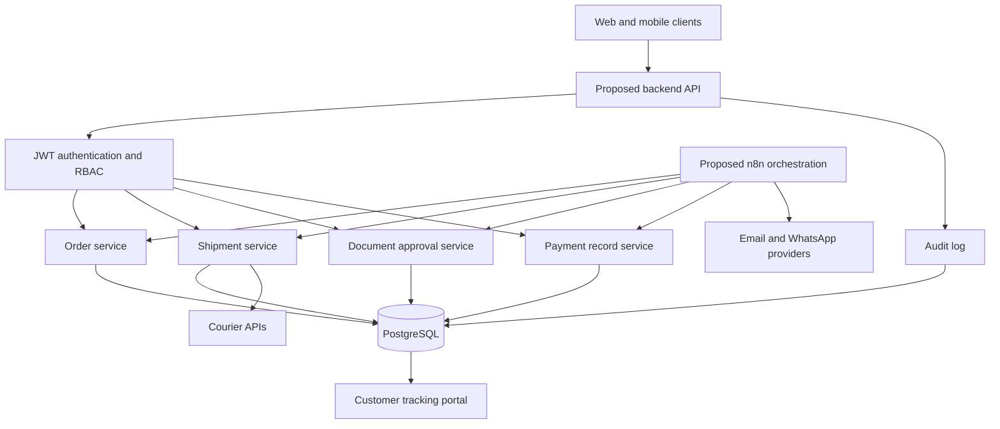
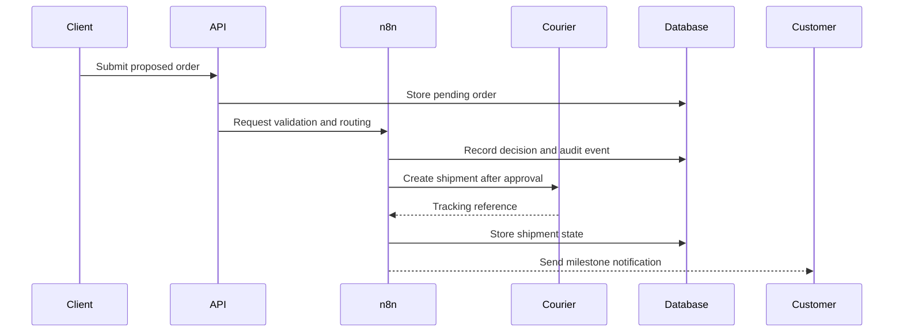

# SwiftRoute

> **Evidence status: Concept / architecture specification — not implemented**

SwiftRoute is a portfolio architecture exercise for a freight and shipment-operations platform. It explores how order intake, document approvals, courier tracking, notifications, payment records, and customer visibility could be joined into one system.

There is **no real client, deployed application, operating shipment volume, or measured business result behind this repository**.

[Open the visual concept page](./index.html)

## Intended problem

Freight operations can involve disconnected intake forms, document reviews, courier systems, payment records, and customer updates. SwiftRoute proposes a system boundary for coordinating those activities without claiming that the system has been built.

## Proposed users

- Operations staff
- Supervisors
- Compliance reviewers
- Finance staff
- Customers tracking their own shipments
- System administrators

## Proposed architecture

Every component in this diagram is proposed unless a future implementation commit explicitly proves otherwise.



See [docs/architecture.md](./docs/architecture.md) for the proposed component boundaries.

## Proposed capabilities

| Domain | Proposed capability | Implementation status |
|---|---|---|
| Orders | Intake, validation, assignment, approval | Not built |
| Shipments | Courier creation, milestones, ETA/status sync | Not built |
| Documents | Generation, review, approval, download | Not built |
| Notifications | Email and WhatsApp milestone updates | Not built |
| Payments | Invoice and payment-status records | Not built |
| Customer portal | Shipment, document, and notification visibility | Not built |
| Administration | RBAC, settings, audit log | Not built |
| Mobile experience | Operational and customer views | Not built |

## Proposed orchestration



This is a design sequence, not execution evidence.

## Repository structure

```text
.
├── docs/
│   ├── architecture.md
│   ├── proposed-api.md
│   ├── proposed-data-model.md
│   └── roadmap.md
├── .env.example
├── index.html
├── LICENSE
└── README.md
```

## Design decisions

- Separate customer-facing access from internal operational permissions.
- Put authorization and audit logging at the API boundary.
- Keep courier, email, and WhatsApp providers behind adapters.
- Use workflow orchestration for cross-system coordination, not as the sole system of record.
- Model idempotency, retries, and reconciliation before implementing external writes.
- Require human approval for sensitive document, payment, and shipment transitions.

## What is deliberately absent

- Fabricated source code or screenshots
- Fake client branding or testimonials
- Invented shipment metrics or time savings
- Claims of FedEx, DHL, WhatsApp, or payment-provider integration
- Claims of deployment, security testing, users, traffic, or revenue

## Next implementation gate

The concept should only be upgraded to a build after a bounded vertical slice exists and is verified. The recommended first slice is:

```text
Order intake → validation → PostgreSQL record → supervisor review → audit event
```

A future implementation should include source code, migrations, tests, synthetic test evidence, setup instructions, and an updated status register.

## Author

**Oyekola Ololade**  
AI Systems & Integration Engineer

- [GitHub](https://github.com/oyekola-ololade)
- [LinkedIn](https://www.linkedin.com/in/ololade-oyekola-5b1797397/)
- [Email](mailto:oyekolaololade69@gmail.com)

