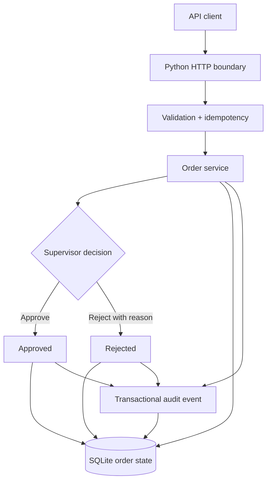

# SwiftRoute

> **Evidence status: Early implementation — tested local vertical slice, not production**

SwiftRoute is an emerging freight-operations platform. This repository contains a working first slice for validated order intake, idempotent creation, supervisor approval/rejection, SQLite persistence, and transactional audit-event recording.

The wider shipment, courier, document, payment, notification, customer-portal, authentication, and PostgreSQL architecture remains proposed work.

[Open the visual project page](./index.html)

<p align="center"></p>

## What is implemented

| Capability | Evidence | Status |
|---|---|---|
| JSON HTTP API | `swiftroute/api.py` | Implemented and locally tested |
| Order validation | `swiftroute/db.py` | Implemented |
| Idempotent creation | unique key + canonical request hash | Implemented and concurrency-tested |
| Supervisor review | PENDING → APPROVED/REJECTED | Implemented and tested |
| Audit events | same transaction as state change | Implemented and invariant-tested |
| SQLite persistence | `swiftroute/schema.sql` in WAL mode | Implemented for the local slice |
| Unit + HTTP tests | `tests/` | 8 tests passing |
| Synthetic stress | `scripts/stress_simulation.py`, `evidence/` | three profiles passing locally |
| Container packaging | `Dockerfile` | build definition present; image not published |

## Implemented architecture



See [architecture](docs/architecture.md), [current visual sources](docs/current-visuals.md), [release manifest](docs/RELEASE_MANIFEST.md), and [changelog](CHANGELOG.md).

## API surface

| Method | Route | Purpose |
|---|---|---|
| `GET` | `/health` | service health |
| `GET` | `/metrics` | current local database counts |
| `POST` | `/orders` | validate/create order; requires `Idempotency-Key` |
| `GET` | `/orders` | list orders |
| `GET` | `/orders/{id}` | fetch order |
| `POST` | `/orders/{id}/review` | approve/reject pending order |
| `GET` | `/orders/{id}/events` | read audit trail |

## Run locally

Requirements: Python 3.11+.

```bash
cp .env.example .env
python -m swiftroute.api
```

Default address: `http://127.0.0.1:8080`. The database is created at `data/swiftroute.db`.

## Verification

```bash
python -m unittest discover -s tests -v
python -m scripts.stress_simulation
```

Current deterministic result: **8 tests passed**.

Verified final local stress run on 2026-08-30:

| Profile | Requests | Concurrency | Result | Throughput | p95 latency |
|---|---:|---:|---|---:|---:|
| Baseline | 270 | 8 | PASS | 380.62 req/s | 82.62 ms |
| Contention | 720 | 32 | PASS | 349.14 req/s | 432.93 ms |
| Burst | 1,440 | 64 | PASS | 330.13 req/s | 836.31 ms |

Across all **2,430 synthetic requests**, the final run recorded zero unexpected responses. Replayed keys did not create duplicate orders, competing second reviews returned HTTP 409, and stored order/audit counts matched the expected invariants.

These are **local loopback simulations using SQLite**. They are not production load tests, deployment evidence, an SLA, or a capacity guarantee. See [stress report](evidence/stress-report.md), [raw JSON](evidence/stress-report.json), and [remediation log](evidence/REMEDIATION.md).

## Evidence boundary

This repository does **not** claim:

- production deployment or a public hosted API;
- authentication, authorization, tenant isolation, or PostgreSQL support;
- real courier, WhatsApp, email, document, payment, or storage integrations;
- web/mobile customer applications;
- real shipments, users, clients, revenue, uptime, or business outcomes;
- security certification or production performance.

## Next engineering gate

Authentication + role-based access around the existing review boundary, followed by PostgreSQL migration and integration tests. External courier writes stay out of scope until idempotency, webhook verification, reconciliation, and provider-failure handling are implemented.

## Author

**Oyekola Ololade**  
AI Systems & Integration Engineer

- [GitHub](https://github.com/oyekola-ololade)
- [LinkedIn](https://www.linkedin.com/in/ololade-oyekola-5b1797397/)
- [Email](mailto:oyekolaololade69@gmail.com)
