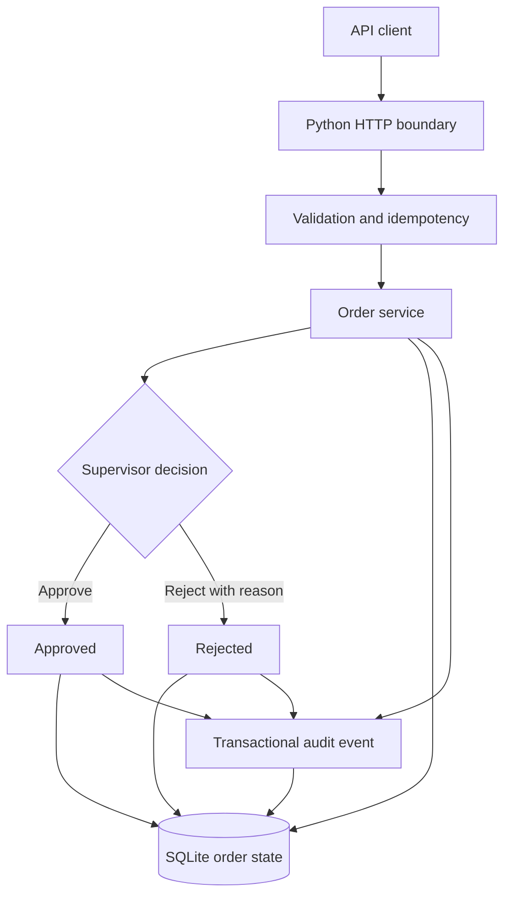

# SwiftRoute

> **Evidence status: Early implementation — tested local vertical slice, not production**

SwiftRoute is an emerging freight-operations platform. This repository now contains a working first slice for validated order intake, idempotent creation, supervisor approval or rejection, SQLite persistence, and immutable audit-event recording.

The wider shipment, courier, document, payment, notification, customer-portal, authentication, and PostgreSQL architecture remains proposed work.

[Open the visual project page](./index.html)

## What is implemented

| Capability | Evidence | Status |
|---|---|---|
| JSON HTTP API | `swiftroute/api.py` | Implemented and locally tested |
| Order validation | `swiftroute/db.py` | Implemented |
| Idempotent order creation | Unique key plus canonical request hash | Implemented and concurrency-tested |
| Supervisor review | Controlled pending → approved/rejected transition | Implemented and tested |
| Audit events | Written in the same transaction as state changes | Implemented and invariant-tested |
| SQLite persistence | `swiftroute/schema.sql` in WAL mode | Implemented for the local slice |
| Unit and HTTP integration tests | `tests/` | 8 tests passing |
| Synthetic stress simulations | `scripts/stress_simulation.py`, `evidence/` | Three profiles passing locally |
| Container packaging | `Dockerfile` | Build definition present; image not published |

## Implemented architecture



See [the architecture document](./docs/architecture.md) for implemented and proposed boundaries.

## API surface

| Method | Route | Purpose |
|---|---|---|
| `GET` | `/health` | Service health |
| `GET` | `/metrics` | Current local database counts |
| `POST` | `/orders` | Validate and create an order; requires `Idempotency-Key` |
| `GET` | `/orders` | List orders with optional status and limit filters |
| `GET` | `/orders/{id}` | Fetch one order |
| `POST` | `/orders/{id}/review` | Approve or reject a pending order |
| `GET` | `/orders/{id}/events` | Read its audit trail |

Full examples and error semantics are in [docs/proposed-api.md](./docs/proposed-api.md).

## Run locally

Requirements: Python 3.11 or newer. The current slice has no third-party runtime dependency.

```bash
cp .env.example .env
python -m swiftroute.api
```

The default address is `http://127.0.0.1:8080` and the database is created at `data/swiftroute.db`.

Create an order:

```bash
curl -i http://127.0.0.1:8080/orders \
  -H 'Content-Type: application/json' \
  -H 'Idempotency-Key: demo-order-0001' \
  -d '{
    "customer_name": "Demo Exporter",
    "origin": "Lagos",
    "destination": "Abuja",
    "cargo_description": "Sealed textile cartons",
    "weight_kg": 120
  }'
```

Review the returned order ID:

```bash
curl -i http://127.0.0.1:8080/orders/ORDER_ID/review \
  -H 'Content-Type: application/json' \
  -d '{"decision":"approved","reviewer":"Demo Supervisor"}'
```

## Verification

Run the deterministic test suite:

```bash
python -m unittest discover -s tests -v
```

Current result: **8 tests passed**. They cover HTTP behavior, validation, idempotent replay, conflicting idempotency payloads, review-state conflicts, rejection rules, audit trails, and 40 concurrent submissions sharing one idempotency key.

Run the synthetic stress profiles:

```bash
python -m scripts.stress_simulation
```

The verified run on 2026-08-30 produced:

| Profile | Requests | Concurrency | Result | Throughput | p95 latency |
|---|---:|---:|---|---:|---:|
| Baseline | 270 | 8 | PASS | 380.62 req/s | 82.62 ms |
| Contention | 720 | 32 | PASS | 349.14 req/s | 432.93 ms |
| Burst | 1,440 | 64 | PASS | 330.13 req/s | 836.31 ms |

Across all **2,430 synthetic requests**, the final run recorded zero unexpected responses. Replayed keys did not create duplicate orders, competing second reviews returned HTTP 409, and stored order and audit-event counts matched the expected invariants.

These are local simulations on one machine using loopback HTTP and SQLite. They are **not** production load tests, deployment evidence, an SLA, or a capacity guarantee. See [the full Markdown report](./evidence/stress-report.md), [raw JSON](./evidence/stress-report.json), and [the remediation log](./evidence/REMEDIATION.md).

## Repository structure

```text
.
├── swiftroute/
│   ├── api.py
│   ├── db.py
│   └── schema.sql
├── tests/
│   ├── test_api.py
│   └── test_repository.py
├── scripts/
│   └── stress_simulation.py
├── evidence/
│   ├── stress-report.json
│   ├── stress-report.md
│   └── REMEDIATION.md
├── docs/
│   ├── architecture.md
│   ├── proposed-api.md
│   ├── proposed-data-model.md
│   └── roadmap.md
├── Dockerfile
├── Makefile
└── index.html
```

## Evidence boundary

This repository does **not** claim:

- A production deployment or public hosted API
- Authentication, authorization, tenant isolation, or PostgreSQL support
- Real courier, WhatsApp, email, document, payment, or storage integrations
- A web dashboard, mobile application, or customer portal
- Real shipments, users, clients, revenue, uptime, or business outcomes
- Security certification or production performance

## Next engineering gate

The next credible slice is authentication and role-based access around the existing order-review boundary, followed by PostgreSQL migration and integration tests. Courier writes should remain out of scope until idempotency, webhook verification, reconciliation, and provider failure handling are implemented.

## Author

**Oyekola Ololade**  
AI Systems & Integration Engineer

- [GitHub](https://github.com/oyekola-ololade)
- [LinkedIn](https://www.linkedin.com/in/ololade-oyekola-5b1797397/)
- [Email](mailto:oyekolaololade69@gmail.com)
