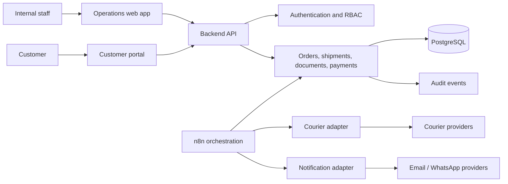

# SwiftRoute Proposed Architecture

## Status

This is an architecture specification. No component described here is represented as deployed or production-tested.

## Context map

## Proposed boundaries

### Client applications

- Internal operations dashboard
- Customer portal
- Optional mobile client

Clients should not communicate directly with courier, messaging, storage, or database services.

### Backend API

Proposed responsibilities:

- Authentication and authorization
- Validation
- Stable domain operations
- Idempotency keys for mutating requests
- Audit-event creation
- Provider-neutral contracts for workflows

### PostgreSQL

Proposed as the authoritative system of record for users, customers, orders, shipments, documents, invoices, state transitions, and audit events.

### n8n

Proposed for event coordination:

- Order-intake routing
- Document-generation requests
- Courier status polling
- Milestone notifications
- Payment reminders
- Exception escalation

n8n should not silently replace database state controls or authorization.

### Provider adapters

Courier and notification providers should be isolated behind adapters so provider changes do not leak across the domain model.

## Reliability design targets

These are targets for future implementation, not existing features:

- Idempotent external writes
- Exponential-backoff retries
- Dead-letter or exception queues
- Provider webhook signature verification
- State reconciliation jobs
- Immutable audit events
- Human review for sensitive transitions
- Monitoring for stale shipments and failed notifications

## Security design targets

- Short-lived access tokens and rotating refresh tokens
- Role-based authorization at every domain action
- Encrypted transport
- Secret storage outside source control
- Customer data partitioning
- Document access controls
- Signed download URLs
- Auditability of approval and payment changes

