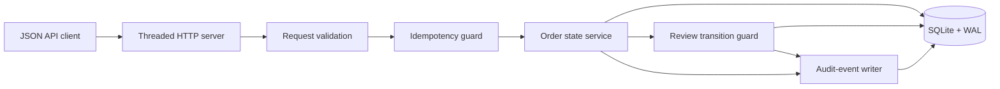
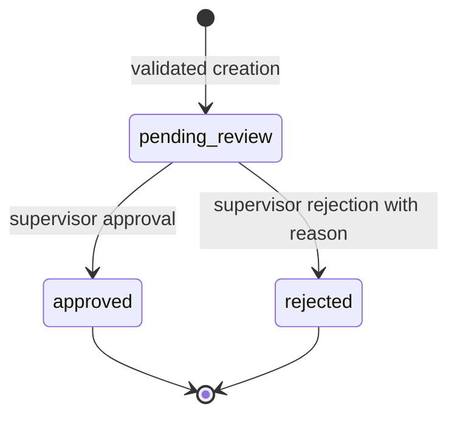

# SwiftRoute Architecture

## Status

SwiftRoute is an **early implementation**. The order-intake and supervisor-review slice below exists in source code and has been tested locally. Everything in the proposed-extension table remains unimplemented.

## Implemented component map

### HTTP boundary

`swiftroute/api.py` implements bounded JSON parsing, route dispatch, consistent error responses, body-size limits, order endpoints, and a configurable connection backlog. It uses Python's standard library `ThreadingHTTPServer`.

### Domain and persistence boundary

`swiftroute/db.py` owns validation, canonical request hashing, idempotent creation, state-transition rules, and audit persistence. Each write opens `BEGIN IMMEDIATE`; the order mutation and matching audit event commit or roll back together.

### State model

The current state machine is deliberately small:

There is no transition out of `approved` or `rejected` in this slice. A second review attempt returns a conflict.

### Idempotency behavior

- New key plus valid payload: one order and one `order.created` event are committed.
- Same key plus the same normalized payload: the original order is returned.
- Same key plus a different normalized payload: the request returns a conflict.
- The unique database constraint is the final concurrency guard.

## Implemented reliability controls

| Control | Implementation |
|---|---|
| Request validation | Type, length, numeric-bound, and rejection-reason checks |
| Request-size limit | 64 KiB JSON maximum |
| Idempotent creation | Unique key and SHA-256 canonical request hash |
| Atomic audit | Audit event in the same transaction as the order mutation |
| State control | Only pending orders may be approved or rejected |
| Lock handling | SQLite 30-second busy timeout and WAL mode |
| Burst acceptance | HTTP connection backlog set to 256 after stress-test discovery |
| Reproducibility | Standard-library runtime and checked-in simulation script |

## Proposed extensions

| Component | Status | Required gate |
|---|---|---|
| Authentication and RBAC | Not implemented | Identity model, password/token policy, authorization tests |
| PostgreSQL repository | Not implemented | Migration, transaction parity, integration environment |
| Shipment service | Not implemented | State model and idempotent courier boundary |
| Courier adapters | Not implemented | Sandbox contract tests, webhook signatures, reconciliation |
| Documents | Not implemented | Storage controls, signed access, approval policy |
| Notifications | Not implemented | Provider adapters, retries, delivery records |
| Payments | Not implemented | Separate ledger and reconciliation design |
| Customer portal | Not implemented | Tenant isolation and authenticated read model |
| n8n orchestration | Not implemented | Stable API contracts and failure queues first |

## Deployment boundary

The Dockerfile packages the current service, but this repository does not contain proof of a built image, hosted deployment, TLS, reverse proxy, backup policy, monitoring, or production database. SQLite is appropriate for this bounded local slice, not presented as the final multi-user platform datastore.
