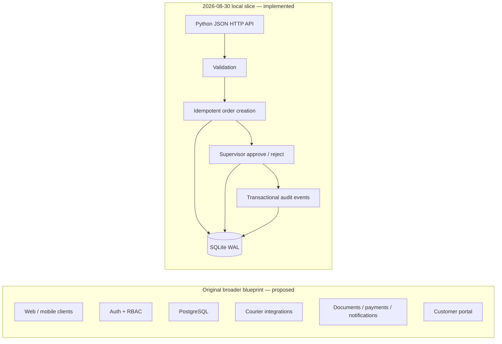
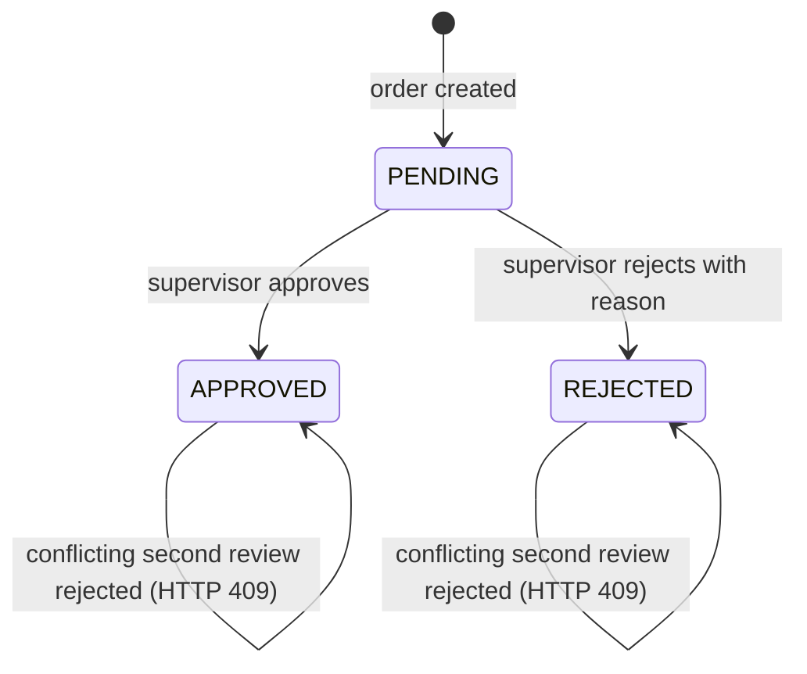
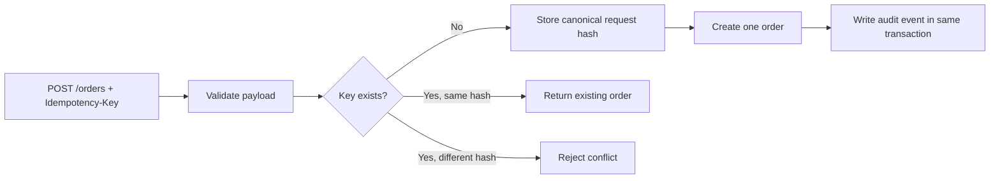
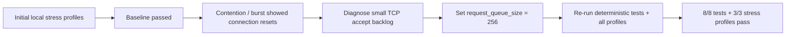

# SwiftRoute Current Visual Sources

## Blueprint vs implemented scope

The broader blueprint remains design scope. The implemented slice proves only the order-state boundary represented on the right.

## Order-state machine

## Idempotency and audit boundary

## Stress-remediation story

This is local loopback evidence only; it is not production capacity or SLA evidence.
