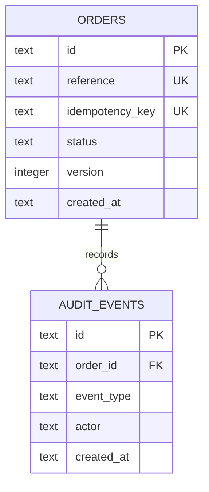

# SwiftRoute Data Model

## Implemented SQLite schema

### `orders`

| Field | Purpose |
|---|---|
| `id` | UUID primary key |
| `reference` | Human-facing `SWR-` reference |
| `idempotency_key` | Unique mutation key |
| `request_hash` | Canonical normalized-payload hash |
| `customer_name` | Current bounded customer label |
| `origin`, `destination` | Route labels |
| `cargo_description` | Bounded cargo summary |
| `weight_kg` | Optional positive numeric weight |
| `status` | `pending_review`, `approved`, or `rejected` |
| `version` | State-change counter |
| review fields | Reviewer, reason, and timestamp |
| timestamps | UTC creation/review times |

### `audit_events`

Stores a UUID, order foreign key, event type, actor, JSON details, and UTC timestamp. Order creation and review events are written inside the same transactions as their state mutations.

## Proposed PostgreSQL model

The earlier platform design also identified users, roles, customers, shipments, documents, invoices, notification records, and provider events. Those tables are not included in the current implementation. Migration should preserve the tested idempotency, transaction, state-transition, and audit invariants before adding new domains.
