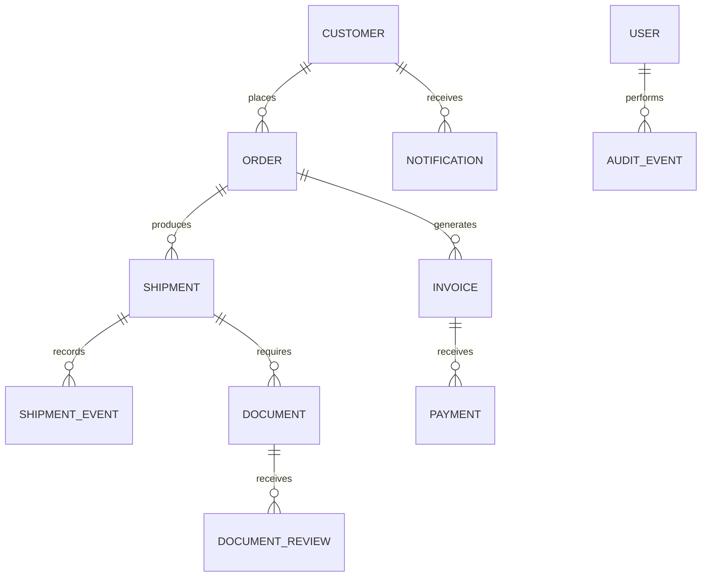

# Proposed Data Model

> Specification only. No migration or operating database is included.

## Entities

- `users`
- `roles`
- `customers`
- `orders`
- `order_items`
- `shipments`
- `shipment_events`
- `documents`
- `document_reviews`
- `invoices`
- `payments`
- `notifications`
- `provider_operations`
- `audit_events`

## Key relationships

## State considerations

Future implementation should define explicit transition rules instead of accepting arbitrary status strings. Each transition should retain actor, timestamp, source, previous state, next state, and correlation/idempotency identifiers.

