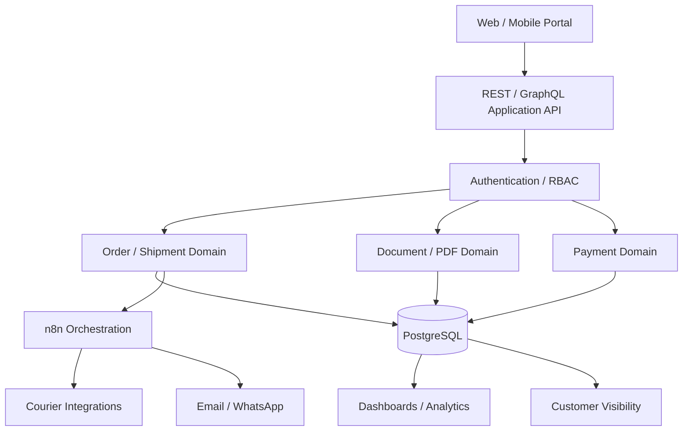

# SwiftRoute Blueprint v1.0 — Proposed System Architecture

> **Status:** DESIGN / PROPOSED SCOPE · not current implementation.

The blueprint describes the wider intended freight/logistics ecosystem. Only a bounded order-control subset is implemented in the current v0.1 local slice.
