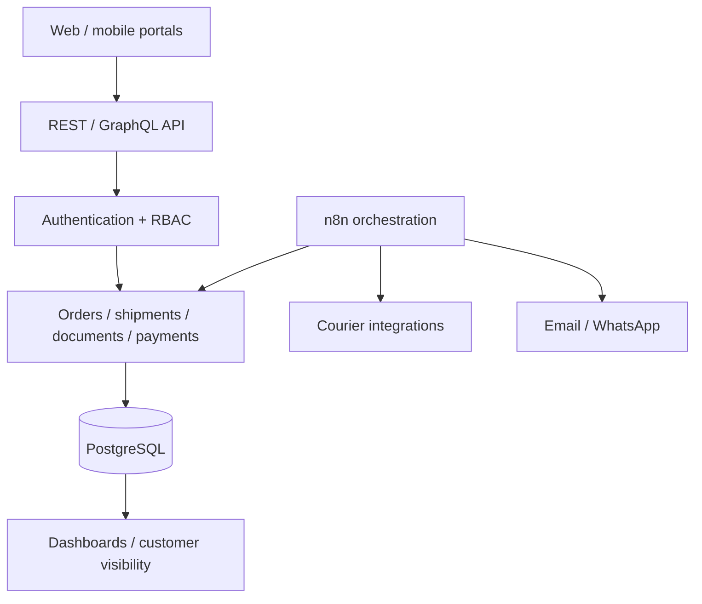

# SwiftRoute Blueprint v1.0 — Version Record

**Status:** PROPOSED HISTORICAL BLUEPRINT · NOT IMPLEMENTED AS A WHOLE

## Blueprint scope

The original SwiftRoute blueprint described a broad freight/logistics ecosystem including:

- web/mobile operational surfaces;
- backend API;
- authentication and RBAC;
- PostgreSQL;
- n8n orchestration;
- order/shipment/document/payment domains;
- courier integrations;
- email/WhatsApp notifications;
- dashboards/customer visibility.

## Architectural intent

## What was actually built later

The 2026-08-30 implementation deliberately narrowed scope to a testable order-state slice: JSON HTTP API, validation, idempotent creation, supervisor approve/reject, SQLite WAL persistence and transactional audit events.

## Evidence boundary

The blueprint proves architectural thinking, not implementation of the full ecosystem. Do not use v0.1 local tests as evidence that courier, payments, authentication, PostgreSQL, n8n orchestration or customer portals exist.

## Media policy

Historical/proposed blueprint: no demo/screenshot placeholders.