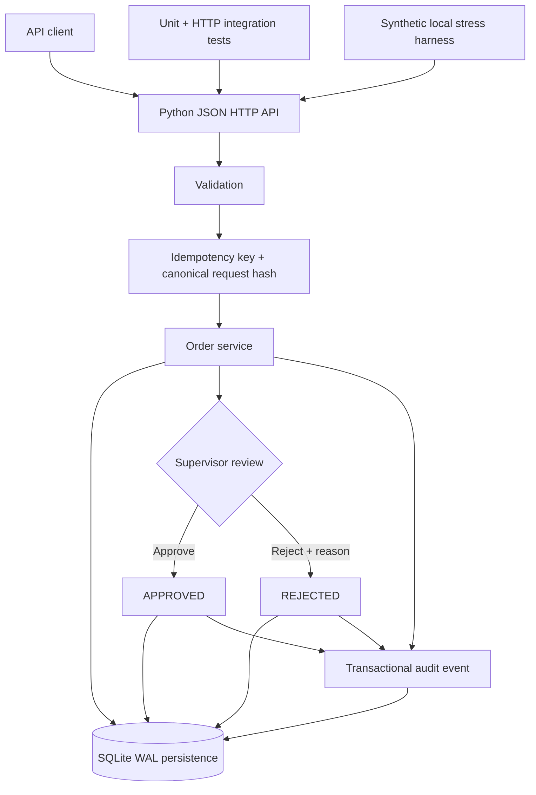

# SwiftRoute v0.1 — Implemented Local Architecture

> **Status:** CURRENT IMPLEMENTED / VERIFIED LOCALLY.

## Scope boundary

This is the architecture that the current code/tests support. Authentication/RBAC, PostgreSQL, courier integrations, n8n orchestration, documents, payments, notifications and customer applications are not part of v0.1.

Measured stress evidence is local loopback/SQLite evidence, not production capacity.
