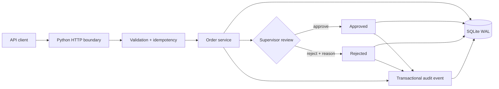

# SwiftRoute v0.1 — Current Local Implementation Record

**Status:** IMPLEMENTED + LOCALLY VERIFIED VERTICAL SLICE · NOT PRODUCTION  
**Implementation date:** 2026-08-30

## Implemented scope

- Python JSON HTTP API;
- order validation;
- idempotent order creation;
- create/list/read order operations;
- controlled pending → approved/rejected supervisor transition;
- conflicting second review rejected;
- SQLite WAL persistence;
- audit events written transactionally with state changes;
- unit + HTTP integration tests;
- concurrency/idempotency checks;
- local synthetic stress harness.

## Current architecture

## Verified test evidence

Current recorded result: **8/8 tests passed** after remediation.

The tests cover HTTP behavior, validation, idempotent replay, conflicting payloads using the same idempotency key, controlled review transitions, rejection requirements, audit invariants and concurrent submissions sharing an idempotency key.

## Synthetic stress evidence

| Profile | Requests | Concurrency | Throughput | p95 | Result |
|---|---:|---:|---:|---:|---|
| Baseline | 270 | 8 | 380.62 req/s | 82.62 ms | PASS |
| Contention | 720 | 32 | 349.14 req/s | 432.93 ms | PASS |
| Burst | 1,440 | 64 | 330.13 req/s | 836.31 ms | PASS |

Total: **2,430 local synthetic requests**.

These numbers are loopback/SQLite evidence on one machine, not production capacity or an SLA.

## Current media

- `../../assets/local-scope-and-stress.svg`
- `../../evidence/current/demo/README.md` — current demo placeholder;
- `../../evidence/current/screenshots/README.md` — current screenshot placeholder/register.

## Not implemented

Authentication/RBAC, PostgreSQL migration, n8n orchestration, courier writes, documents/PDF, payments, notifications, dashboards/web/mobile and production hosting remain outside v0.1.

## Claim boundary

v0.1 is a real tested local system slice. It is not the full SwiftRoute blueprint and not production deployment evidence.