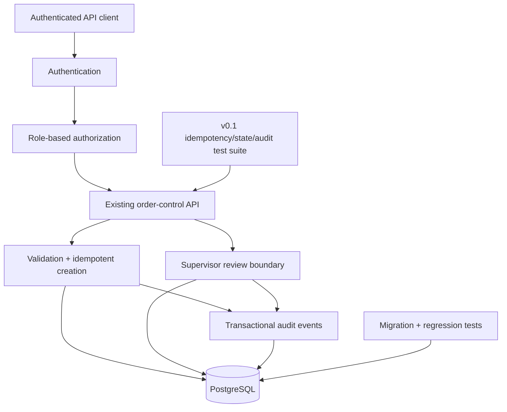

# SwiftRoute v0.2 — Proposed Next Architecture

> **Status:** PROPOSED NEXT ENGINEERING GATE · not implemented.

External courier writes, documents, payments, notifications and customer portals remain outside this proposed increment. v0.2 is only promoted after auth/RBAC, PostgreSQL migration and regression evidence exist.
