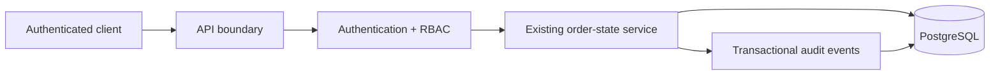

# SwiftRoute v0.2 — Proposed Next Engineering Gate

**Status:** PROPOSED · NOT IMPLEMENTED

## Intended scope

v0.2 should harden the existing order-state boundary before adding courier/payment/document complexity.

### Proposed additions

- authentication boundary;
- role-based access for operational actions;
- PostgreSQL migration from local SQLite;
- migration/rollback strategy;
- authorization tests around order review;
- persistence/integration tests against PostgreSQL;
- stronger deployment/configuration controls.

## Proposed architecture

## Explicitly deferred

Courier writes, external messaging, payment execution, document generation and customer portals should remain deferred until the authenticated/PostgreSQL core demonstrates stable state, idempotency, authorization, migration and recovery behavior.

## Acceptance gate

- authenticated happy path;
- unauthorized/forbidden paths;
- role-specific review permissions;
- idempotent creation preserved after PostgreSQL migration;
- audit invariants preserved;
- migration + rollback evidence;
- concurrency tests rerun;
- security/config review;
- updated current evidence after implementation.

## Media policy

Proposed future version: do not manufacture demo/screenshots. When v0.2 is actually implemented, create a new implemented version folder and capture real current media.